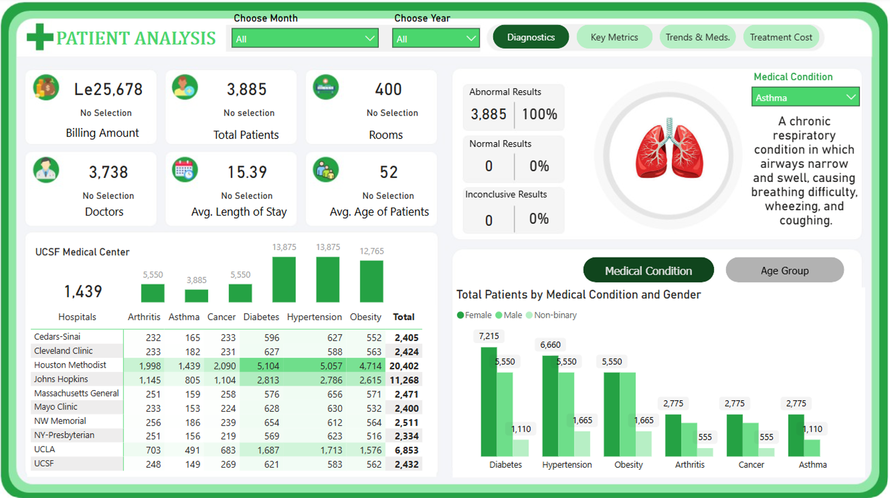
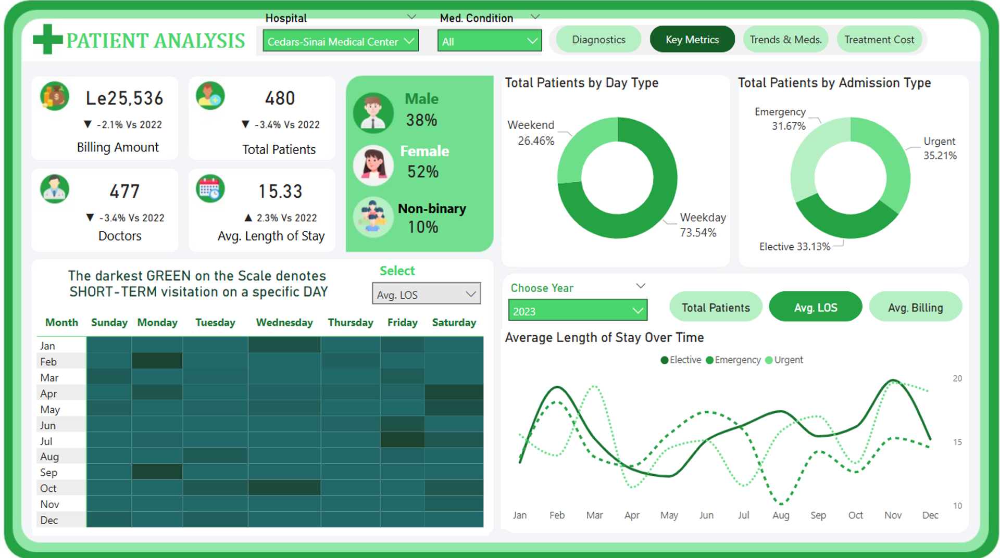
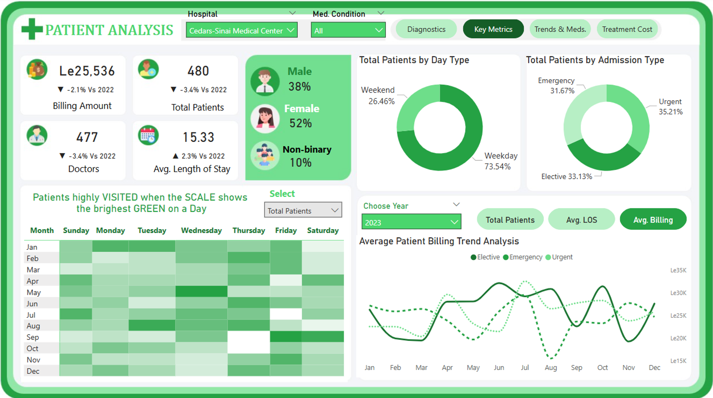
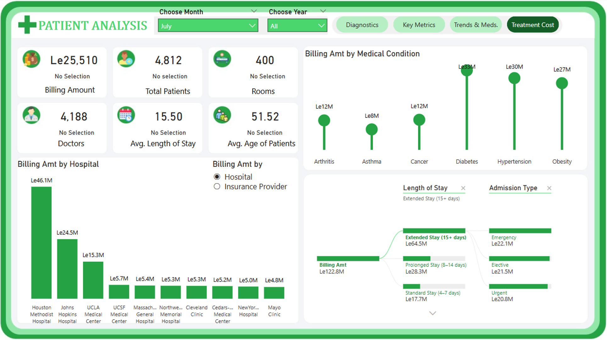
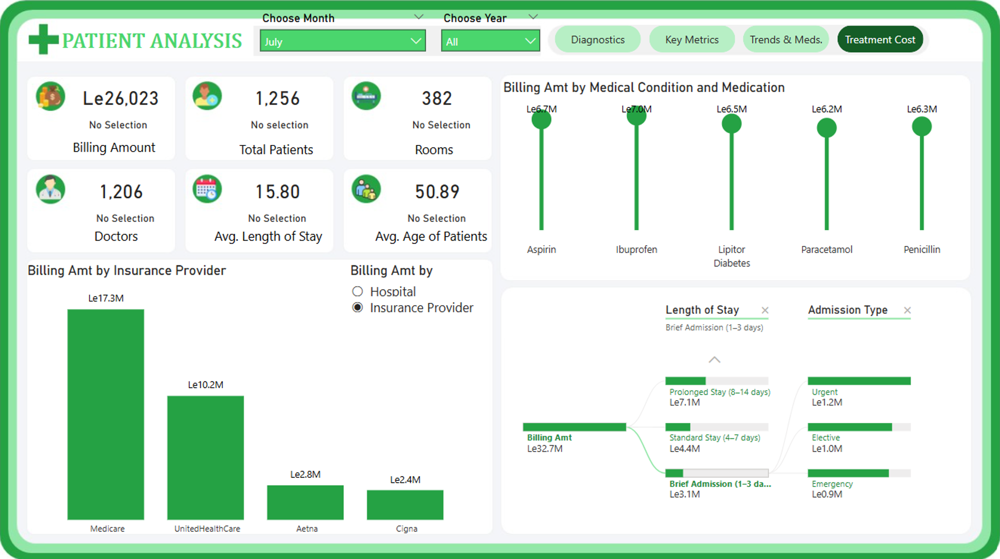
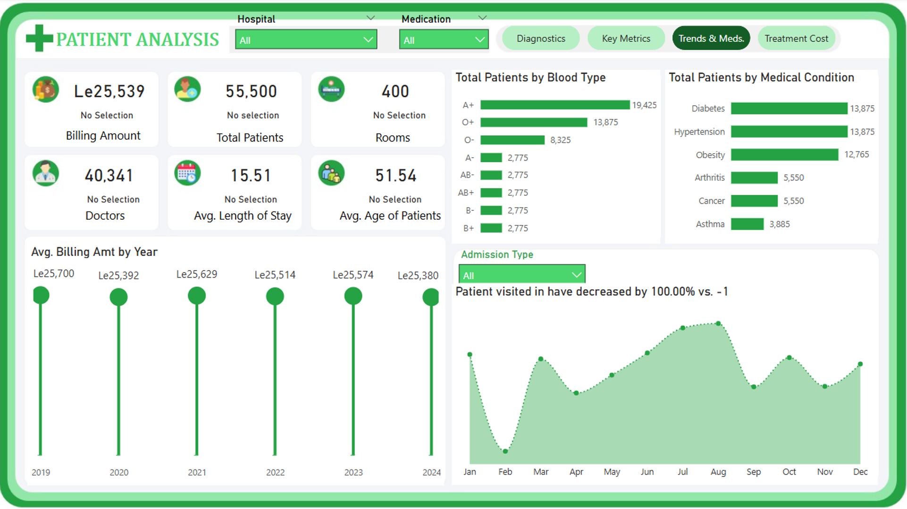

# Patient Hospital Analysis Dashboard

## Project Overview

The **Patient Hospital Analysis Dashboard** is a comprehensive healthcare analytics solution developed using **Microsoft Power BI** to monitor patient demographics, medical conditions, hospital performance, treatment costs, admissions, and operational efficiency.

This dashboard enables healthcare administrators and decision-makers to identify patient trends, optimize resource allocation, improve patient outcomes, and support data-driven decision-making.

---

# Project Objectives

The primary objectives of this analysis are to:

- Monitor patient demographics and healthcare utilization.
- Analyze the prevalence of major medical conditions.
- Evaluate hospital revenue performance.
- Identify trends in patient admissions and hospital stays.
- Assess operational efficiency across healthcare facilities.
- Support strategic healthcare planning and resource allocation.

---

# Dashboard Snapshots

## 🔹 Overview Dashboard

> Insert overview dashboard screenshot here

---

## 🔹 Patient Demographics Analysis

> Insert patient demographics dashboard screenshot here

---

## 🔹 Medical Condition Analysis

> Insert medical condition dashboard screenshot here

---

## 🔹 Revenue & Billing Analysis

> Insert revenue dashboard screenshot here

---

## 🔹 Hospital Performance Analysis

> Insert hospital performance dashboard screenshot here

---

## 🔹 Admission & Length of Stay Analysis

> Insert admission analysis dashboard screenshot here

---

# Key Performance Indicators (KPIs)

| KPI | Value |
|------|--------|
| Total Patients | 55,500 |
| Average Age | 52 Years |
| Female Patients | 52% |
| Male Patients | 38% |
| Non-Binary Patients | 10% |
| Average Length of Stay | 15.5 Days |
| Highest Revenue Condition | Diabetes |
| Top Performing Hospital | Houston Methodist Hospital |

---

# Business Insights

## 1. Patient Demographics

- The healthcare network serves approximately **55,500 patients**.
- Average patient age is approximately **52 years**.
- Female patients account for the majority of the patient population.

### Insight

The hospital network primarily serves middle-aged and elderly patients, indicating a greater need for chronic disease management and preventive healthcare programs.

---

## 2. Medical Condition Analysis

### Most Common Conditions

| Condition | Patient Count |
|------------|--------------|
| Diabetes | 13,875 |
| Hypertension | 13,875 |
| Obesity | 12,765 |
| Arthritis | 5,550 |
| Cancer | 5,550 |
| Asthma | 3,885 |

### Insight

Diabetes, Hypertension, and Obesity represent the majority of diagnosed conditions, highlighting the growing impact of lifestyle-related diseases.

---

## 3. Revenue Analysis

### Revenue by Medical Condition

| Condition | Revenue |
|------------|-----------|
| Diabetes | Le33M |
| Hypertension | Le30M |
| Obesity | Le27M |
| Arthritis | Le12M |
| Cancer | Le12M |
| Asthma | Le8M |

### Insight

Chronic diseases generate most of the healthcare revenue, emphasizing the importance of disease management programs.

---

## 4. Hospital Performance

### Top Revenue-Generating Hospitals

| Hospital | Revenue |
|-----------|-----------|
| Houston Methodist Hospital | Le46.1M |
| Johns Hopkins Hospital | Le24.5M |
| UCLA Medical Center | Le15.3M |

### Insight

Houston Methodist Hospital significantly outperforms other facilities and can serve as a benchmark for operational excellence.

---

## 5. Admission Analysis

### Admission Type Distribution

| Admission Type | Percentage |
|---------------|------------|
| Urgent | 35.21% |
| Elective | 33.13% |
| Emergency | 31.67% |

### Insight

A high percentage of urgent and emergency admissions suggests opportunities for stronger preventive care initiatives.

---

## 6. Length of Stay Analysis

| Stay Category | Revenue |
|--------------|----------|
| Extended Stay (15+ Days) | Le64.5M |
| Prolonged Stay (8–14 Days) | Le28.3M |
| Standard Stay (4–7 Days) | Le17.7M |

### Insight

Extended hospital stays contribute significantly to revenue but may also increase operational costs and reduce bed availability.

---

## 7. Seasonal Patient Trends

### Insight

Patient visits fluctuate throughout the year, with peak demand occurring during mid-year periods.

This information can be leveraged for workforce planning and resource optimization.

---

# Business Recommendations

## 1. Strengthen Chronic Disease Management

Develop targeted programs for:

- Diabetes
- Hypertension
- Obesity

This will improve patient outcomes while reducing readmission rates.

---

## 2. Expand Preventive Healthcare Programs

Implement:

- Routine health screenings
- Community health outreach
- Wellness awareness campaigns

to reduce avoidable emergency admissions.

---

## 3. Optimize Length of Stay

Introduce:

- Early discharge planning
- Remote patient monitoring
- Home healthcare support

to improve bed turnover rates and operational efficiency.

---

## 4. Replicate High-Performing Hospital Practices

Analyze operational strategies used by Houston Methodist Hospital and apply successful practices across other facilities.

---

## 5. Improve Resource Planning

Use historical patient trends to optimize:

- Staffing levels
- Bed capacity
- Medical equipment allocation

during peak demand periods.

---

## 6. Diversify Revenue Streams

Expand:

- Specialized healthcare services
- Preventive care packages
- Outpatient treatment programs

to support sustainable revenue growth.

---

# Tools & Technologies Used

- Microsoft Power BI
- Power Query
- DAX (Data Analysis Expressions)
- Data Modeling
- Healthcare Analytics
- Business Intelligence
- Data Visualization

---

# Skills Demonstrated

- Healthcare Analytics
- Data Storytelling
- Dashboard Development
- KPI Monitoring
- Revenue Analysis
- Operational Performance Analysis
- Trend Analysis
- Business Intelligence
- Strategic Decision Support

---

# Conclusion

The Patient Hospital Analysis Dashboard provides valuable insights into patient demographics, medical conditions, hospital performance, admissions, and revenue generation. The analysis reveals that chronic diseases such as Diabetes, Hypertension, and Obesity are the primary drivers of patient volume and healthcare revenue.

By implementing proactive healthcare strategies, improving preventive care, and optimizing operational efficiency, healthcare organizations can enhance patient outcomes while achieving sustainable growth and resource utilization.

---

## Author

**Joshua Paul Sesay**

Healthcare Analytics | Data Analytics | Business Intelligence | Power BI Developer

---

⭐ If you found this project helpful, feel free to star the repository.
